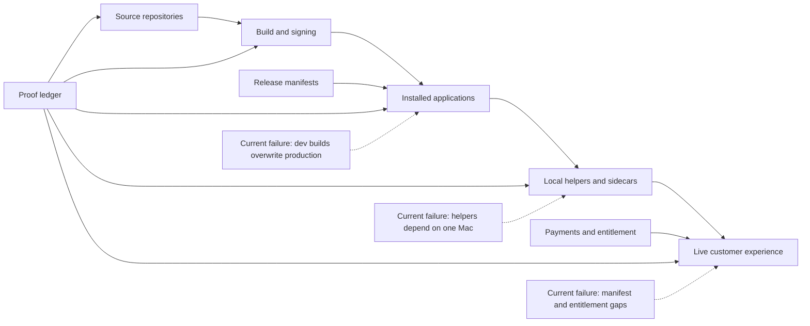

# Portfolio archive

Status is conservative: `verified` means the current live or installed artifact was directly proved; `partial` means a real component exists but a claim, delivery path, trust gate, or clean-install requirement is incomplete; `building` means it is not a public launch.

| System | Kind | Status | Verified surface | Material gap |
|---|---|---:|---|---|
| Black Label Bots | Storefront | verified | Public site and product catalog are live | Product updater/download contract is incomplete |
| Sovereign | Product | partial | Native app and local daemon run | Installed app is ad-hoc and daemon depends on this Mac's repo/virtualenv |
| Vigil | Product | partial | Storefront, Stripe objects, installed sidecar | Current release naming/manifest and trusted installed artifact are inconsistent |
| Sunset | Product | partial | Site, browser studio, Stripe checkout, signed app | Delivery entitlement and release manifest require containment |
| Real Estate / Bestate | Product | partial | Public property API, branded site, central checkout | Branded CTAs and updater schema are not connected end to end |
| Trading | Product | partial | Native code and installed bundle | Runtime API is down; installed build is ad-hoc; updater schema fails |
| Circuit | Product | partial | Signed shell is installed | Runtime architecture and clean-install behavior do not match the universal claim |
| Academy | Product | partial | Native build and release manifest exist | Local ad-hoc build is newer than the trusted release |
| Marketing | Internal system | partial | Native build and automation source exist | Local ad-hoc build replaced the trusted installed artifact |
| HQ | Internal system | partial | App UI and local service run | Clean install requires local source, Homebrew Node, and LaunchAgents |
| AS Golf Clothing | Client system | partial | Public Cloudflare site and separate Shopify store exist | Cloudflare order flow is a mail draft, not commerce; source is not versioned |
| Blackwater | Client system | building | Public staging site exists | Domain, email, checkout, and deployment provenance are unfinished |
| Gulf Coast Wellness | Client presence | unverified | Existing third-party booking profile | No verified Black Label source repository or deployment found |

## Architecture fault lines

The archive is the proof ledger. A repository, website screenshot, or passing unit test is evidence for one layer only; it does not prove the customer path.
